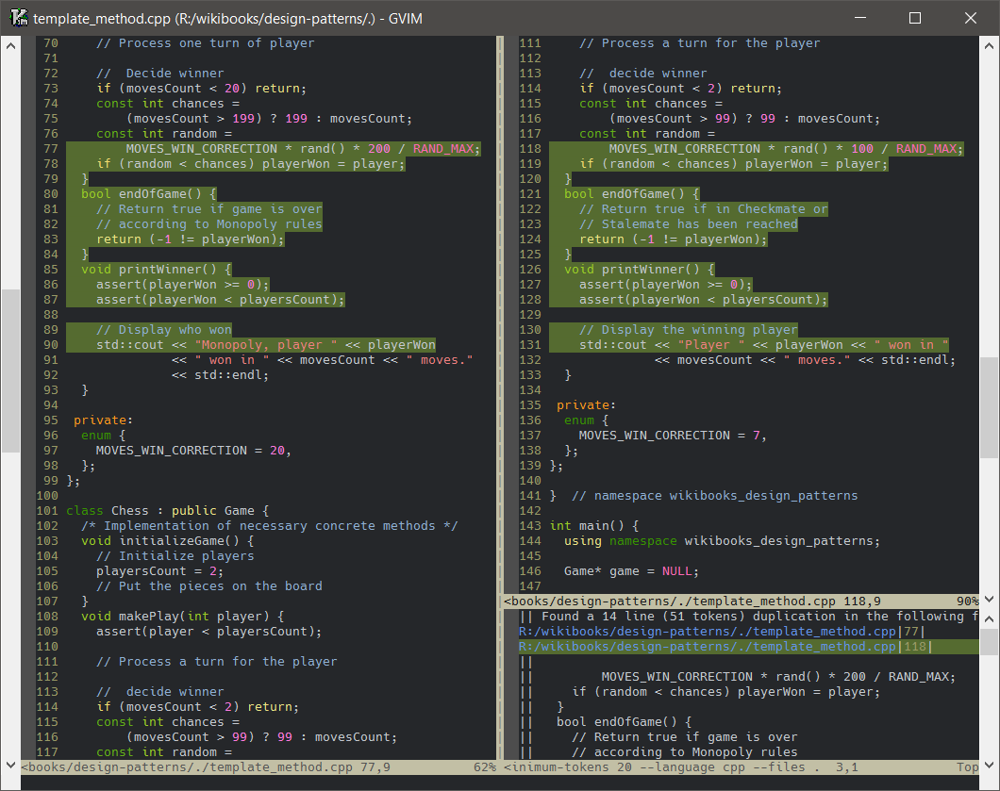

Copy/Paste Finder
=================

CPF (Copy/Paste Finder) is a Vim Plugin for finding copy/paste regions in code.

CPF (Copy/Paste Finder) makes PMD/CPD's or Sloppy's output easier to navigate.
CPF shows detected copied/pasted regions in vertical splits and highlights
the found regions.

See [Vim doc](doc/cpf.txt) file for usage and installation instructions and for more info.

Below is a screenshot of Copy/Paste Finder with GVim 8.0 and PMD/CPD 6.1.0.

PMD/CPD
-------
PMD's Copy/Paste Detector (CPD) finds duplicated code.
PMD is an extensible cross-language static code analyzer.
PMD is an open source project.

see https://pmd.github.io/ to download it and for more info.

Sloppy
------
Sloppy scans all source code in a directory and generates a report on how
'sloppy' the code is... sloppiness being a measurement of a repetitive code
style: under abstraction (copy / pasting) and over abstraction (pointless
complexity).

Sloppy is written by Wouter van Oortmerssen.

see http://strlen.com/sloppy/ to download it and for more info.

Notes
-----
> Tested with Vim version 8.0 and above. It can run on Vim 7.4 too, but not
  fully verified.  This plugin works only if 'compatible' is not set.

> Above source code in the screenshot can be found at: _Template Method_ 
  section of the web page _C++ Programming/Code/Design Patterns_ 
  that is found at WikiBooks. see:
>
>  https://en.wikibooks.org/wiki/C%2B%2B_Programming/Code/Design_Patterns#Template_Method

> Above screenshot uses Hack font.
> see https://sourcefoundry.org/hack/  or https://github.com/source-foundry/Hack

> Source file was formatted by clang-format (version LLVM 6.0.0) with:
>
> `clang-format -style="{BasedOnStyle: Google, ColumnLimit: 55}" in.cpp > out.cpp`
